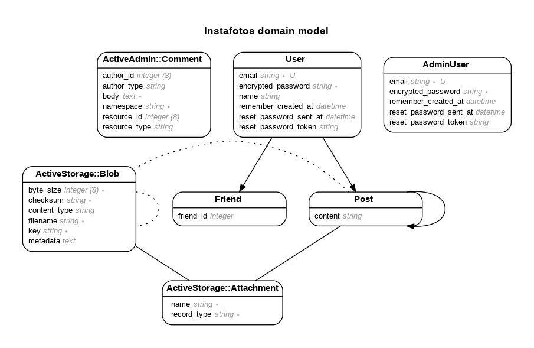

# InstaFotos

Esta app fue creada principalmente para realizar la nivelación de los estudiantes de la carrera FullStack Rails G38. El proyecto está dividido en 4 avances para 4 días, en los cuales se reforzarán distintos aspectos: 

### Día 1:

* CRUD manual

* Validaciones

* Manejo de assets, principalmente estilos

* Configuraciones necesarias para el deploy

* Deploy a Heroku

### Día 2: 

* Autenticación con Devise

* Configuración de atributos extra

* Asociación de recursos

* Manipulación de los datos de la sesión actual a traves de helpers

* Limitación de accesos y acciones sobre los recursos

* Deploy a Heroku

### Día 3: 

* Asociaciones recursivas 

* Filtros de búsqueda 

* Paginación

* Panel de administración

* Deploy a Heroku

### Día 4: 

* Creación de API REST

* Manejo de peticiones y respuestas a cada endpoint

* Acceso a cada endpoint usando autenticación manual y Devise

* Deploy a Heroku 

El modelo utilizado para este proyecto es el siguiente: 

Y los avances serán publicados en el siguiente link: 

[https://instafotosapp.herokuapp.com](https://instafotosapp.herokuapp.com/)

Para acceder a la API es necesario utilizar la misma url, además de los siguientes endpoints: 

* GET api/posts -> retorna todos los posts del usuario (requiere autenticación con cuenta existente en la app)

* GET api/explore -> retorna todos los posts existentes

* GET api/date/:date_1/:date_2 -> retorna todos los posts dentro del rango de fechas especificado (usar formato año-mes-dia)

* POST api/posts/create -> permite crear un post (requiere autenticación con cuenta existente en la app, atributos permitidos: image_url, content)

Los avances esperados programados para cada día está en la rama Master con el tag correspondiente. Se realizarán trabajos en equipo para la resolución de los distintos problemas, los cuales una vez solucionados por los estudiantes se expondrán algunas soluciones alternativas.

Se realizarán evaluaciones paulatinas asociadas a cada avance, con el fin de llevar un seguimiento más detallado aún de cada estudiante. Una vez terminado el proyecto, se realizará una evaluación final del resultado de cada estudiante, para el cual se revisará tanto el código creado y respaldado en GitHub como también la App publicada en Heroku.

Para más detalles, puedes contactarme [aquí](mailto:diegopr178@gmail.com).